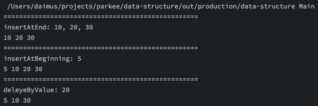
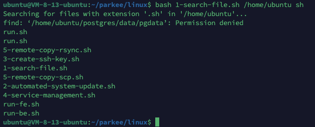
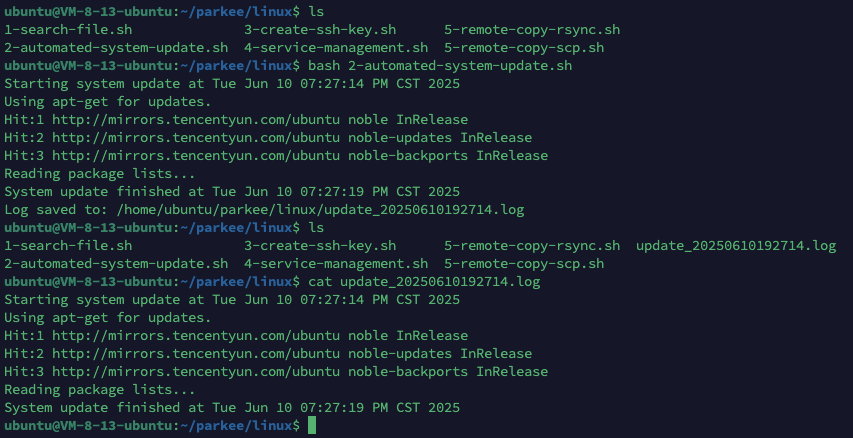
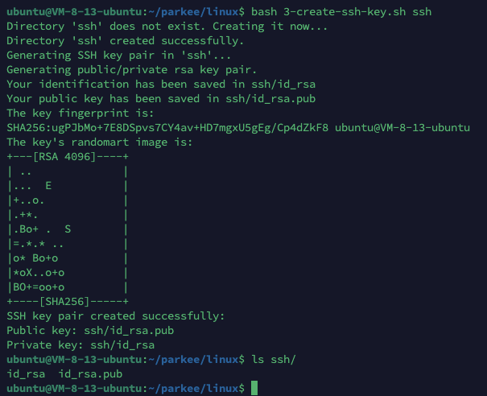
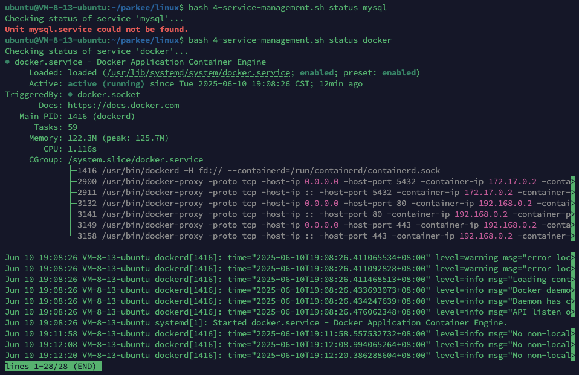
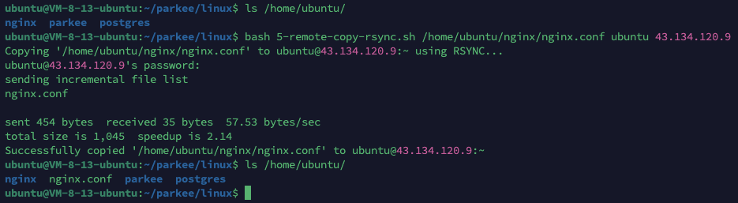
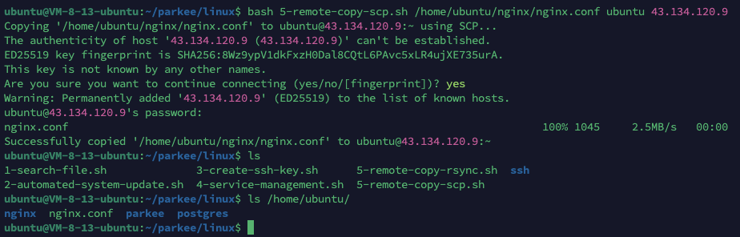
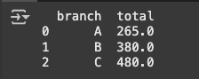

# PARKEE TECHNICAL TEST

## Data Structure
Anda diminta untuk mengimplementasikan Single Linked List di Java tanpa menggunakan
library List. Anda harus mengimplementasikan kelas Node dan SingleLinkedList, serta
metode untuk melakukan beberapa operasi dasar pada linked list.

### Kelas Node
Kelas Node harus memiliki atribut berikut:
- int data: Menyimpan data integer dari node.
- Node next: Menyimpan referensi ke node berikutnya dalam linked list.

### Kelas SingleLinkedList
Kelas SingleLinkedList harus memiliki atribut berikut:
- Node head: Menyimpan referensi ke kepala linked list.

Operasi yang harus diimplementasikan:
1. insertAtEnd(int data): Menambahkan node baru dengan nilai data di akhir linked list.
2. insertAtBeginning(int data): Menambahkan node baru dengan nilai data di awal linked list.
3. deleteByValue(int data): Menghapus node pertama yang ditemukan dengan nilai data dari linked list.
4. display(): Menampilkan seluruh elemen dalam linked list dari kepala hingga akhir.

### Jawab:
[DataStructure - Main.java](./data-structure/Main.java)
<br>


## Data Structure 2
```java
import java.util.HashMap;
public class PairSum {
    public static int countPairs(int[] A, int k) {
        HashMap<Integer, Integer> freqMap = new HashMap<>();
        int count = 0;

        for (int num : A) {
            int complement = k - num;
            if (freqMap.containsKey(complement)) {
                count += freqMap.get(complement);
            }
            freqMap.put(num, freqMap.getOrDefault(num, 0) + 1);
        }
        return count;
    }
    public static void main(String[] args) {
        int[] A = {1, 5, 7, -1, 5};
        int k = 6;
        System.out.println(countPairs(A, k)); // Output: 2
    }
}
```
### Pertanyaan:
1. Bagaimana memori untuk list dialokasikan dan dikelola dalam metode countPairs?
2. Apa yang akan terjadi pada memori yang dialokasikan untuk list setelah metode countPairs selesai dieksekusi?
3. Apakah ada potensi kebocoran memori dalam kode di atas? Jelaskan jawaban Anda.

### Jawab:
1. int[] A dilewatkan sebagai referensi. Memori A dialokasikan di luar metode countPairs. Di dalam countPairs, dan HashMap freqMap dialokasikan di heap. HashMap ini menyimpan pasangan kunci-nilai.

2. Memori int[] A tetap dialokasikan karena memang dilewatkan dari main. Namun, HashMap freqMap yang dialokasikan di heap di dalam countPairs akan dikumpulkan oleh garbage collector setelah countPairs selesai dieksekusi dan tidak ada lagi referensi aktif yang merujuk kepadanya.

3. Tidak, HashMap yang dibuat di dalam countPairs bersifat lokal. Setelah metode selesai, objek HashMap ini tidak lagi dapat diakses, sehingga akan dikumpulkan oleh garbage collector.

## Task Linux
1. Pencarian File Berdasarkan Ekstensi file (MANAGEMENT FILE) Buatlah sebuah shell script yang menerima dua parameter: direktori dan ekstensi file. Script ini harus mencari semua file dengan ekstensi yang diberikan di dalam direktori tersebut dan menampilkan daftar nama file yang ditemukan.
2. Automasi Pembaharuan Sistem (BASIC SYSTEM) Buatlah sebuah shell script yang akan secara otomatis memperbaharui semua package di sistem menggunakan package manager yang sesuai dengan family linux (misal ‘apt’, ‘yum’ atau sebagainya). Script harus juga mencatat hasil dari setiap pembaruan kedalam sebuah file log.
3. Membuat dan Menyimpan SSH Key (SSH) Buatlah sebuah shell script yang akan membuat sepasang SSH Key (public dan private) dengan menggunakan ssh-keygen dan menyimpannya di direktori yang ditentukan oleh pengguna sebagai parameter. Jika direktori tidak ada, script harus membuatnya terlebih dahulu.
4. Pengelolaan Service (SERVICE) Buatlah sebuah shell script yang dapat memulai, menghentikan, dan memeriksa status dari sebuah service tertentu di sistem. Script harus memiliki parameter untuk menentukan tindakan yang diinginkan (start, stop, status) dan nama service.
5. Men-copy Direktori ke Server Remote (SCP) Buatlah sebuah 2 shell script (scp, dan rsync) yang menerima tiga parameter: file source, username, dan ip address server tujuan. Script ini harus menyalin file tersebut ke direktori home pengguna di server remote menggunakan ‘scp’ dan ‘rsync’.

### Jawab
1. [Linux - 1-search-file.sh](./linux/1-search-file.sh) <br>

2. [Linux - 2-automated-system-update.sh](./linux/2-automated-system-update.sh) <br>

3. [Linux - 3-create-ssh-key.sh](./linux/3-create-ssh-key.sh) <br>

4. [Linux - 4-service-management.sh](./linux/4-service-management.sh)

5. [Linux - 5-remote-copy-rsync.sh](./linux/5-remote-copy-rsync.sh) <br>
 <br>
[Linux - 5-remote-copy-scp.sh](./linux/5-remote-copy-scp.sh) <br>


## Koordinasi ke Support dan Engineer
### Pertanyaan:
Anda menemukan bahwa ada isu kritis yang mempengaruhi sistem production dan memerlukan koordinasi dengan tim support dan engineer. Jelaskan langkah-langkah yang akan Anda ambil untuk mengkoordinasikan penyelesaian masalah ini.
### Jawab:
1. Konfirmasi dan Validasi Issue <br>
Identifikasi sumber masalah dan root causenya (apabila memungkinkan). Kumpulkan evidence berupa log/screenshoot/trace error. Buat dokumentasi untuk reproduce issue tersebut.
2. Eskalasi Awal <br>
Informasikan ke team/squad leader tentang detail issue yang sudah diidentifikasi sebelumnya. Jika scope issue berada di luar tim maka minta team leader untuk menginformasikan issue tersebut ke tim tersebut untuk ditentukan aksi selanjutnya.
3. Komunikasi Terpusat & Pembentukan Tim Respons Insiden (Dilakukan oleh Team Lead) <br>
Buat group khusus untuk koordinasi (misal Group Whatsapp, Topic Discord atau Slack). Undang siapa saja yang terlibat dalam issue ini (misal tim support, infra, developer, BA, PO).
4. Diagnosa dan Solusi <br>
Presentasikan detail issue, evedence, dan cara reporduce issue yang telah dikumpulkan sebelumnya. Kolaborasi tim respons guna menemukan solusi dan aksi selanjutnya.
7. Penyelesaian dan Post-Mortem <br>
Lakukan aksi yang telah disepakati sebelumnya. Tes kembali, dan minta QA untuk melakukan testing pada area issue tersebut dan kemungkinan dampaknya. Dokumentasikan langkah yang diambil. Terakhir sampaikan issue tersebut, aksi yang diambil, dampaknya, dan cara pencegahan dimasa mendatang pada rapat post-mortem, atau retrospective meeting.

## Scripting data
Gunakanlah Python dan pandas untuk menyelesaikan soal dibawah, termasuk penggabungan beberapa file dan pembersihan data untuk memudahkan analisis.

### Pertanyaan:
Anda diberikan beberapa file CSV yang berisi data transaksi dari berbagai cabang sebuah toko. Setiap file berisi kolom berikut:
- transaction_id
- branch
- date
- product_id
- quantity
- price
- customer_id

Beberapa tugas yang perlu Anda lakukan adalah:
1. Gabungkan semua file CSV menjadi satu DataFrame.
2. Bersihkan data dengan cara berikut:
- Hapus baris yang memiliki nilai NaN pada kolom transaction_id, date, dan customer_id.
- Ubah format kolom date menjadi tipe datetime.
- Hilangkan duplikat berdasarkan transaction_id, pilih data berdasarkan date terbaru.
- Setelah data duplikat dihilangkan, hitung total penjualan per cabang dan simpan hasilnya ke file baru total_sales_per_branch.csv dengan kolom branch dan total.

Berikut adalah file CSV yang perlu Anda gabungkan: branch_a.csv, branch_b.csv, branch_c.csv.
```csv
branch_a.csv

transaction_id,branch,date,product_id,quantity,price,customer_id
1,A,2023-01-01,101,2,50.0,C001
2,A,2023-01-02,102,1,20.0,C002
3,A,2023-01-03,103,3,15.0,C003
4,A,2023-01-04,101,2,50.0,C004
5,A,,104,1,30.0,C005
6,A,2023-01-06,105,2,25.0,
```
```csv
branch_b.csv

transaction_id,branch,date,product_id,quantity,price,customer_id
7,B,2023-01-01,101,1,50.0,C006
8,B,2023-01-02,106,2,40.0,C007
9,B,2023-01-03,107,3,25.0,C008
10,B,2023-01-04,108,1,30.0,C009
11,B,2023-01-05,109,2,35.0,C010
12,B,2023-01-06,107,3,25.0,C011
```
```csv
branch_c.csv

transaction_id,branch,date,product_id,quantity,price,customer_id
13,C,2023-01-01,110,1,60.0,C012
14,C,2023-01-02,111,2,20.0,C013
14,C,2023-01-03,112,1,70.0,C014
15,C,2023-01-04,113,2,50.0,C015
16,C,2023-01-05,114,3,30.0,C016
17,C,2023-01-06,115,2,80.0,C017
```
Tulislah skrip Python menggunakan pandas untuk menyelesaikan tugas di atas.

### Jawab:
- [main.py](./scripting/main.py)
- [Google Collab Notebook](https://colab.research.google.com/drive/1oWE8wZ-HVWCg1weQL78jnhKdNl_hp08l?usp=sharing)
<br>



## TASK Build Application
You are asked to create a Parking POS program. There are two pages in this program, one is for check-in, and the other is for check-out. The user must be able to input the vehicle plate number and submit it as a ticket on the check-in page. The user must be able to input the vehicle plate number and obtain a ticket based on the vehicle plate number. The system must show the ticket's check-in time, check-out time, and the total price on the check-out page. The total price is calculated based on the length of time between check-in time and check-out time with the rate of 3000 per hour.

After the ticket's needed information is shown, the user can submit the ticket as a finished transaction. In a single instance, vehicles with the same vehicle plate number are unable to be in a parking area at the same time, the system should notify the user on the check-in page when this occurrence happens.

Please design your own UI/UX, use ReactJs programming language and database that you are most comfortable with (using Java Springboot is plus point). We will score you based on UI/UX, Design Pattern, and Database Handling.

### Source Code:
- Frontend: [https://github.com/daimus/parkee-fe](https://github.com/daimus/parkee-fe)
- Backend: [https://github.com/daimus/parkee-be](https://github.com/daimus/parkee-be)

### Live Demo:
- Frontend: [https://parkee.youare.my.id](https://parkee.youare.my.id)
- Backend: [https://parkee-api.youare.my.id/swagger-ui](https://parkee-api.youare.my.id/swagger-ui)